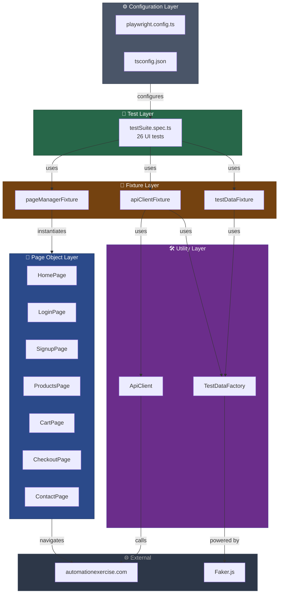

# Playwright Automation Framework


A professional end-to-end test automation framework built to verify that a real e-commerce website works correctly from a user's perspective. Every time a change is made to the website, this framework can automatically run a full suite of tests to confirm nothing is broken — across three different browsers, in parallel, without any manual effort.

---

## What does this project do?

This framework simulates real user behaviour on [AutomationExercise.com](https://automationexercise.com) — an e-commerce demo site. It opens a browser, clicks through the website exactly as a real customer would, and checks that everything works as expected: registering an account, logging in, browsing products, adding items to a cart, completing a purchase, and more.

It runs **26 automated test scenarios** covering the full customer journey.

---

## Why does this matter?

Manual testing is slow, error-prone, and does not scale. This framework allows a team to:

- **Catch bugs early** — tests run automatically on every code change before it reaches production
- **Save time** — what would take a QA engineer hours to test manually runs in minutes
- **Test on multiple browsers** — Chrome, Firefox, and Safari are all covered simultaneously
- **Trust deployments** — no feature ships without passing a full regression suite

---

## What gets tested?

| Area | What is verified |
|---|---|
| Registration | A new user can create an account with full personal and address details |
| Login | Valid credentials grant access; invalid credentials are rejected with a clear error |
| Logout | A logged-in user can sign out and is redirected correctly |
| Products | Products load correctly, can be searched, filtered by category and brand, and viewed in detail |
| Shopping Cart | Items can be added, quantities can be changed, and products can be removed |
| Checkout | A full purchase can be completed including payment details and order confirmation |
| Invoice | A receipt can be downloaded after a successful order |
| Subscriptions | The email subscription form works from both the homepage and the cart page |
| Reviews | A customer can submit a review on a product page |
| Contact Form | The contact form accepts a message and a file attachment |
| Navigation | All key pages load and scroll behaviour works correctly |

---

## How is the framework built?

The framework is written in **TypeScript** and uses **Playwright** — one of the most modern and widely adopted browser automation tools in the industry today. It is structured following industry best practices that make it easy to maintain and extend.

### The main building blocks

**Pages** — Each page of the website (Home, Login, Products, Cart, etc.) has its own dedicated file that knows how to interact with that page. If the website changes a button or a form, only one file needs to be updated — not every single test.

**Tests** — The test scenarios describe user journeys in plain steps: go to the homepage, search for a product, add it to the cart, proceed to checkout. Tests are readable and focused on behaviour, not implementation details.

**Test Data Generation** — No test uses hardcoded names, emails, or credit card numbers. Every run generates fresh, realistic fake data automatically. This means tests never conflict with each other and can run safely in parallel.

**API Setup** — Some tests need a logged-in user to start. Rather than going through the full registration UI every time, the framework creates and cleans up test accounts directly through the website's API. This makes tests faster and more reliable.

**CI/CD Integration** — The framework is connected to GitHub Actions. Every pull request automatically triggers the full test suite. If any test fails, the pull request is blocked from merging until the issue is resolved.

---

## Framework Architecture

The diagram below shows how all the pieces of the framework connect to each other. Think of it as a production line: the configuration sets the rules, the tests define the scenarios, the fixtures provide everything a test needs to run, the page objects know how to operate the website, and the utilities handle data and API calls behind the scenes.



### What each layer does

**Configuration (dark gray)** — Sets the global rules for every test run: which browsers to use, how long to wait before giving up on an action, whether to record a video, and how many times to retry a failing test in CI.

**Test Layer (green)** — Contains the 26 test scenarios. Each test reads like a user story: open the homepage, search for a product, add it to the cart, complete the checkout. Tests do not contain any knowledge of how the website is built — they just describe what should happen.

**Fixture Layer (orange)** — Acts as a service provider for the tests. Before each test starts, fixtures automatically prepare everything it needs: the right page objects, a fresh set of fake user data, and an API client. After the test finishes, fixtures clean up (e.g. deleting test accounts). Tests simply declare what they need and receive it automatically.

**Page Object Layer (blue)** — One file per page of the website. Each file knows exactly where every button, form, and link lives on that page and how to interact with it. If the website's layout changes, only the relevant page file needs to be updated — none of the tests need to change.

**Utility Layer (purple)** — Two reusable helpers. The `TestDataFactory` generates realistic fake names, addresses, emails, and payment details for every test run. The `ApiClient` communicates directly with the website's backend to create or delete test accounts without going through the browser.

**External (charcoal)** — Third-party dependencies: the live website being tested, and Faker.js (the library used to generate fake data).

---

## How to run the tests

```bash
# Install dependencies
npm install

# Install browsers
npx playwright install

# Run all tests
npx playwright test

# Open the HTML report after the run
npx playwright show-report
```

---

## Technologies used

| Tool | Purpose |
|---|---|
| [Playwright](https://playwright.dev) | Browser automation and test runner |
| TypeScript | Strongly typed JavaScript for safer, more maintainable code |
| Faker.js | Generates realistic fake data for each test run |
| GitHub Actions | Runs the full test suite automatically on every pull request |

---

## Project structure at a glance

```
├── tests/          # The 26 test scenarios
├── pages/          # One file per website page, handling all interactions
├── fixtures/       # Shared setup: page objects, test data, API client
├── utils/          # Test data factory and API helper
└── playwright.config.ts  # Browser and test run settings
```
